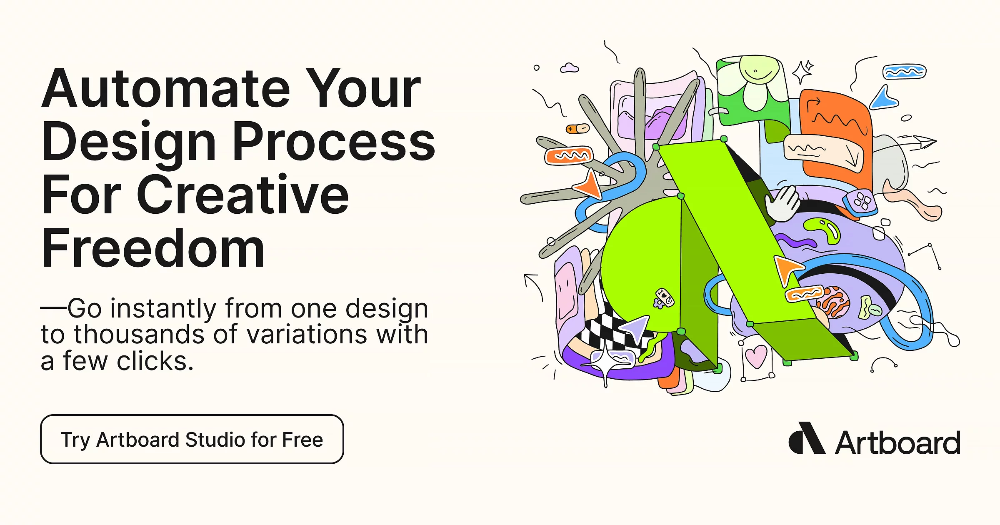

## Summary
Speed up content creation with powerful, focused features. A single place for creatives and agencies to create without switching tools.

## Key Details
- **Source:** [artboard.studio](https://artboard.studio/)
- **Title:** Unified creative workspace
- **Description:** Speed up content creation with powerful, focused features. A single place for creatives and agencies to create without switching tools.

## Visual Assets

