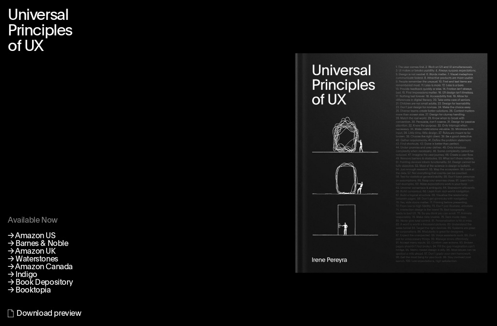

## Summary
Irene Pereyra's new book “Universal Principles of UX: 100 Timeless Strategies to Create Positive Interactions between People and Technology” will be published by Quarto in March of 2023. The book is a

## Key Details
- **Source:** [book.antonandirene.com](https://book.antonandirene.com/)
- **Title:** Universal Principles of UX
- **Description:** Irene Pereyra's new book “Universal Principles of UX: 100 Timeless Strategies to Create Positive Interactions between People and Technology” will be p

## Visual Assets

