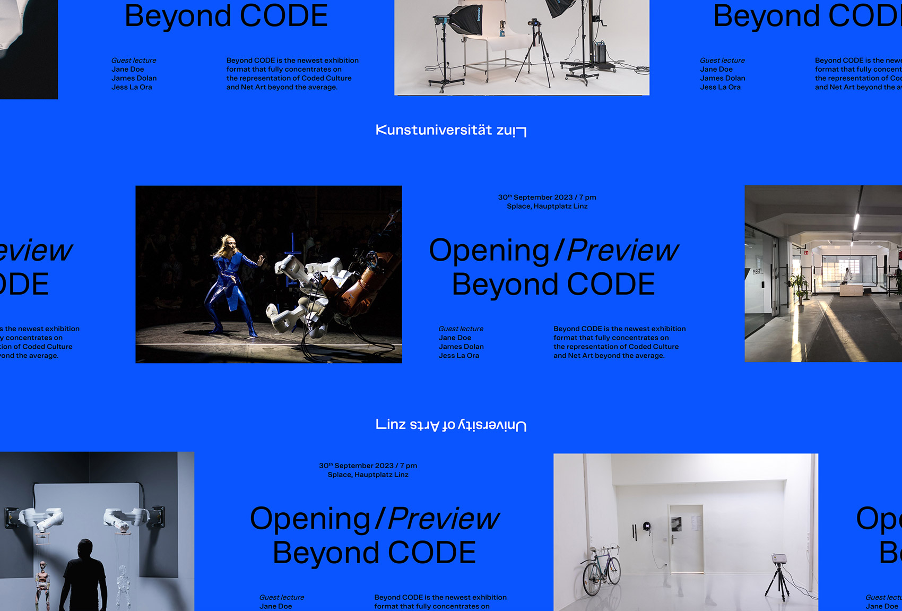

## Summary
University of Arts Linz by Bleed

## Key Details
- **Source:** [visualjournal.it](https://visualjournal.it/univofartslinz)
- **Title:** University of Arts Linz – Visual Journal
- **Description:** University of Arts Linz by Bleed

## Visual Assets

