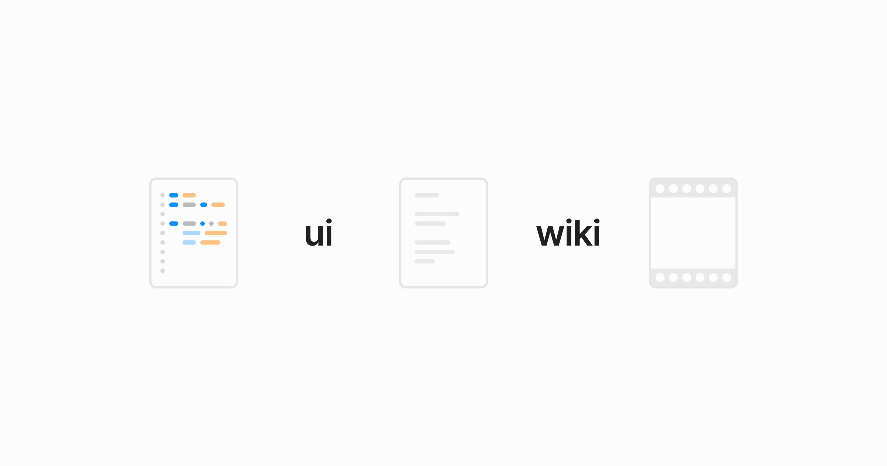

## Summary
A living manual for better interfaces. Learn design principles, motion, typography, and more.

## Key Details
- **Source:** [userinterface.wiki](https://www.userinterface.wiki/)
- **Title:** userinterface.wiki
- **Description:** A living manual for better interfaces. Learn design principles, motion, typography, and more.

## Visual Assets

