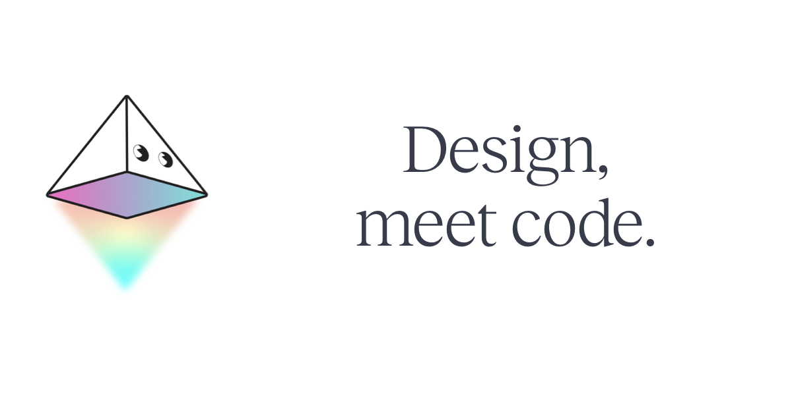

## Summary
Utopia is a production-grade online coding and design tool for React that reads and writes code you’ll want to commit.

## Key Details
- **Source:** [utopia.app](https://utopia.app/)
- **Title:** Utopia: Design and Code on one platform
- **Description:** Utopia is a production-grade online coding and design tool for React that reads and writes code you’ll want to commit.

## Visual Assets

