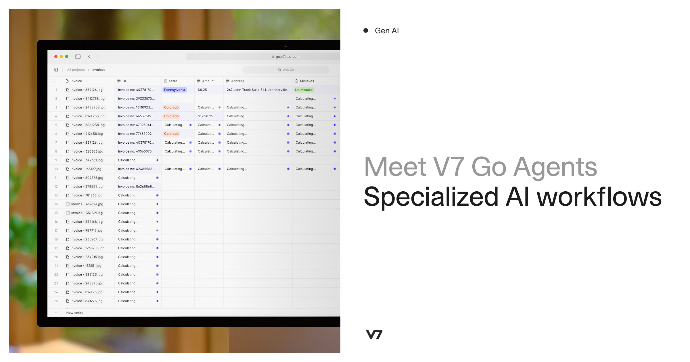

## Summary
Automate complex work with V7 Go. Build specialized AI agents to analyze contracts, process claims, and review financial documents with auditable results.

## Key Details
- **Source:** [v7labs.com](https://www.v7labs.com/)
- **Title:** V7 Go | AI Agent Platform for Finance, Legal & Insurance
- **Description:** Automate complex work with V7 Go. Build specialized AI agents to analyze contracts, process claims, and review financial documents with auditable resu

## Visual Assets

