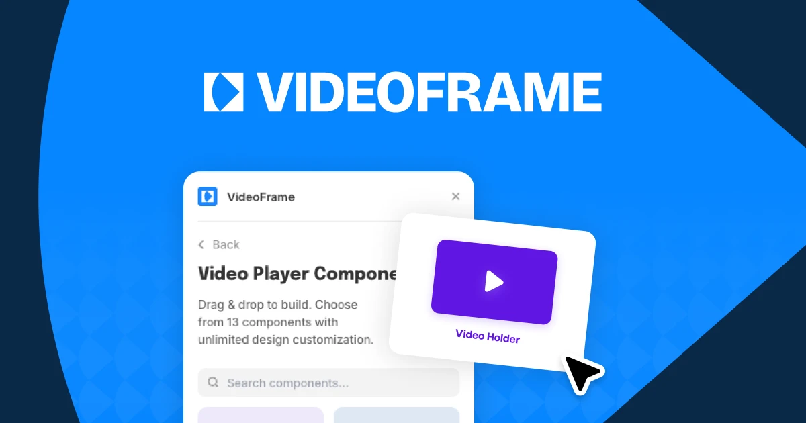

## Summary
The only media player plugin for Framer. Customize playback controls, design audio experiences, and match your site perfectly.

## Key Details
- **Source:** [videoframe.io](https://videoframe.io/)
- **Title:** Videoframe – Custom Video Players for Framer
- **Description:** The only media player plugin for Framer. Customize playback controls, design audio experiences, and match your site perfectly.

## Visual Assets

