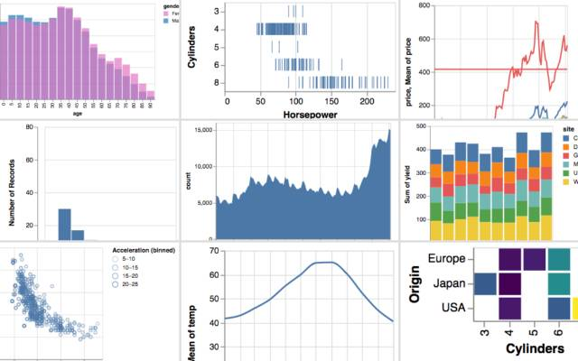

## Summary
A data visualization curriculum of interactive notebooks, using Vega-Lite.

## Key Details
- **Source:** [observablehq.com](https://observablehq.com/collection/@uwdata/visualization-curriculum)
- **Title:** Visualization Curriculum
- **Description:** A data visualization curriculum of interactive notebooks, using Vega-Lite.

## Visual Assets

