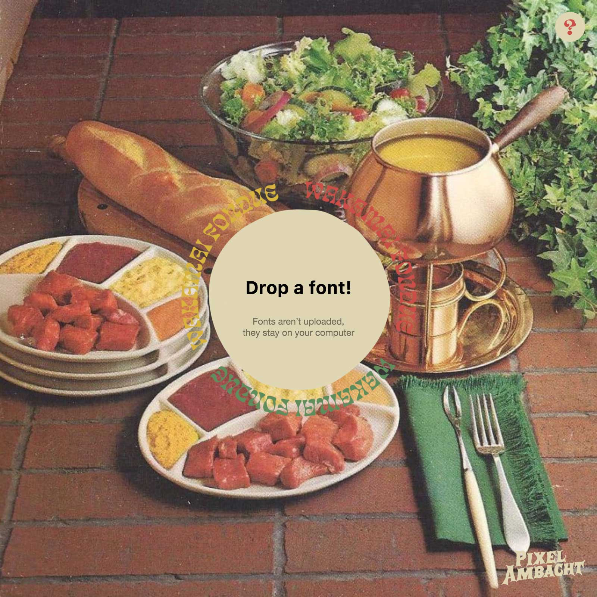

## Summary
The tool that answers the question “what can my font do?”

## Key Details
- **Source:** [wakamaifondue.com](https://wakamaifondue.com/beta/)
- **Title:** Wakamai Fondue
- **Description:** The tool that answers the question “what can my font do?”

## Visual Assets

