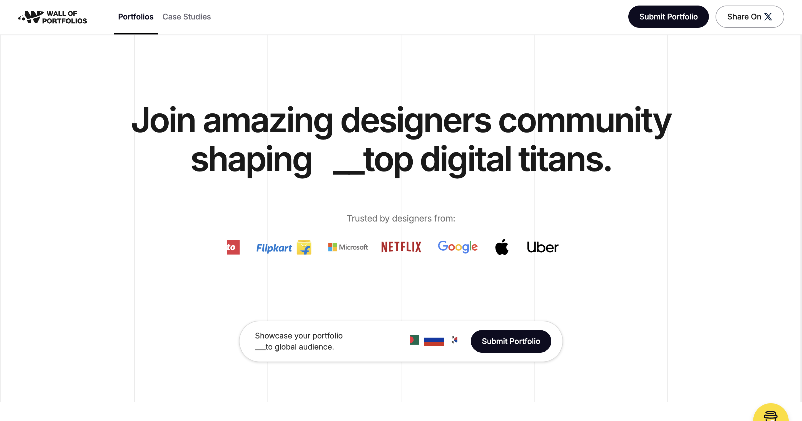

## Summary
Wall of Portfolios showcases the best design portfolios from UX, UI, and product designers. Explore top portfolios of the month, featuring creative and innovative designs, including dark-themed, minim

## Key Details
- **Source:** [wallofportfolios.in](https://www.wallofportfolios.in/)
- **Title:** Wall of Portfolios
- **Description:** Wall of Portfolios showcases the best design portfolios from UX, UI, and product designers. Explore top portfolios of the month, featuring creative an

## Visual Assets

