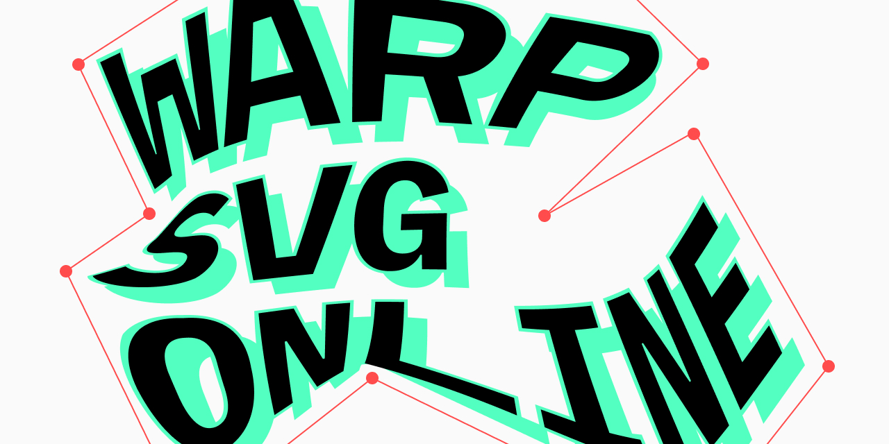

## Summary
Warp and distort SVG online

## Key Details
- **Source:** [pavellaptev.github.io](https://pavellaptev.github.io/warp-svg/)
- **Title:** Warp SVG online
- **Description:** Warp and distort SVG online

## Visual Assets

