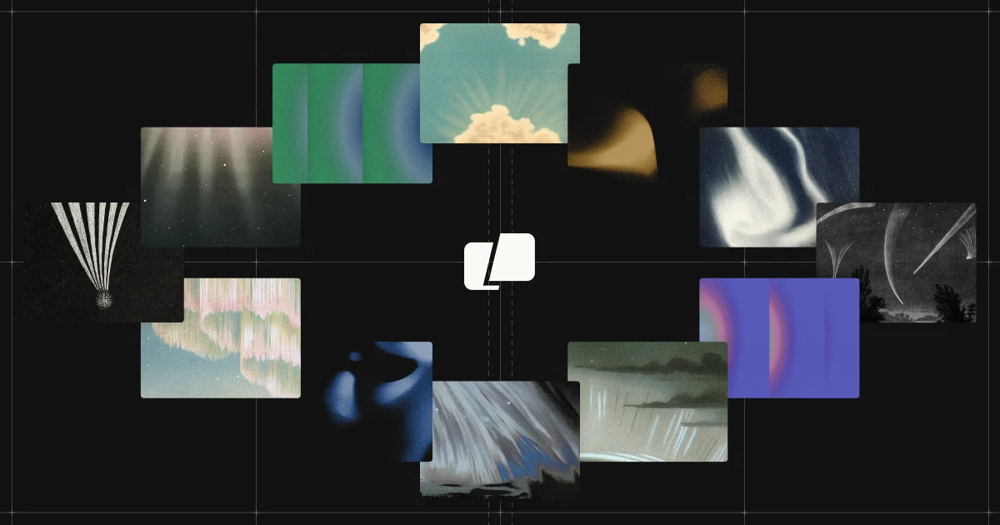

## Summary
Warp is the platform for agentic development — a modern terminal and cloud agent platform used by 700K+ developers at leading enterprises. Explore docs, features, pricing, and more.

## Key Details
- **Source:** [warp.dev](https://www.warp.dev/)
- **Title:** Warp: The Agentic Development Environment
- **Description:** Warp is the platform for agentic development — a modern terminal and cloud agent platform used by 700K+ developers at leading enterprises. Explore doc

## Visual Assets

