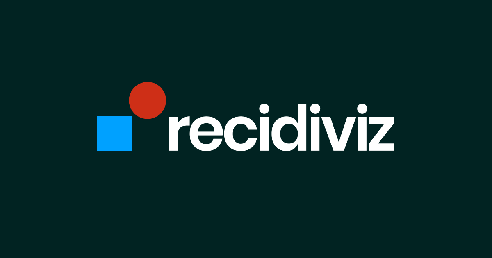

## Summary
We are a non-profit that partners with state criminal justice agencies to advance their use of data and reduce incarceration.

## Key Details
- **Source:** [recidiviz.org](https://www.recidiviz.org/?ref=maxibestof.one)
- **Title:** We are a non-profit that partners with state criminal justice agencies to advance their use of data and reduce incarceration.
- **Description:** We are a non-profit that partners with state criminal justice agencies to advance their use of data and reduce incarceration.

## Visual Assets

