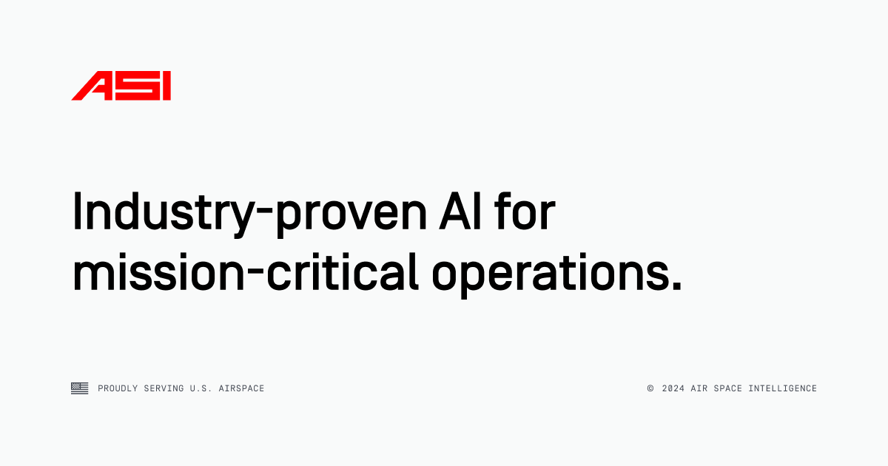

## Summary
We serve critical industries, the U.S. Government, and its allies by predicting, simulating, and optimizing their most complex operations.

## Key Details
- **Source:** [airspace-intelligence.com](https://www.airspace-intelligence.com/)
- **Title:** We serve critical industries, the U.S. Government, and its allies by predicting, simulating, and optimizing their most complex operations.
- **Description:** We serve critical industries, the U.S. Government, and its allies by predicting, simulating, and optimizing their most complex operations.

## Visual Assets

