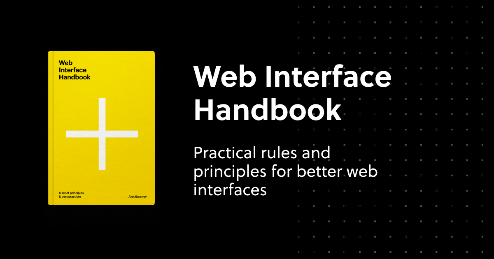

## Summary
A clear, practical guide to web interface design — focused on forms, controls, typography, layouts, and color, with real-world Good/Bad examples.

## Key Details
- **Source:** [imperavi.com](https://imperavi.com/books/web-interface-handbook/)
- **Title:** Web Interface Handbook — Practical Rules and Principles for Better UI Design
- **Description:** A clear, practical guide to web interface design — focused on forms, controls, typography, layouts, and color, with real-world Good/Bad examples.

## Visual Assets

