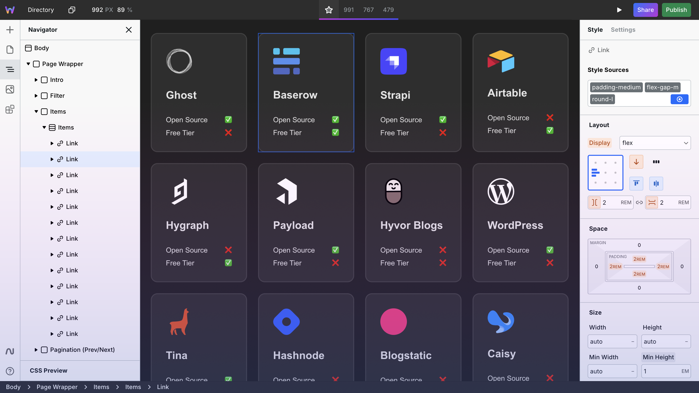

## Summary
Webstudio is an open source website builder that empowers creators to build highly maintainable and fast websites using modern web standards.

## Key Details
- **Source:** [webstudio.is](https://webstudio.is/)
- **Title:** Webstudio — Advanced Open Source Website Builder
- **Description:** Webstudio is an open source website builder that empowers creators to build highly maintainable and fast websites using modern web standards.

## Visual Assets

