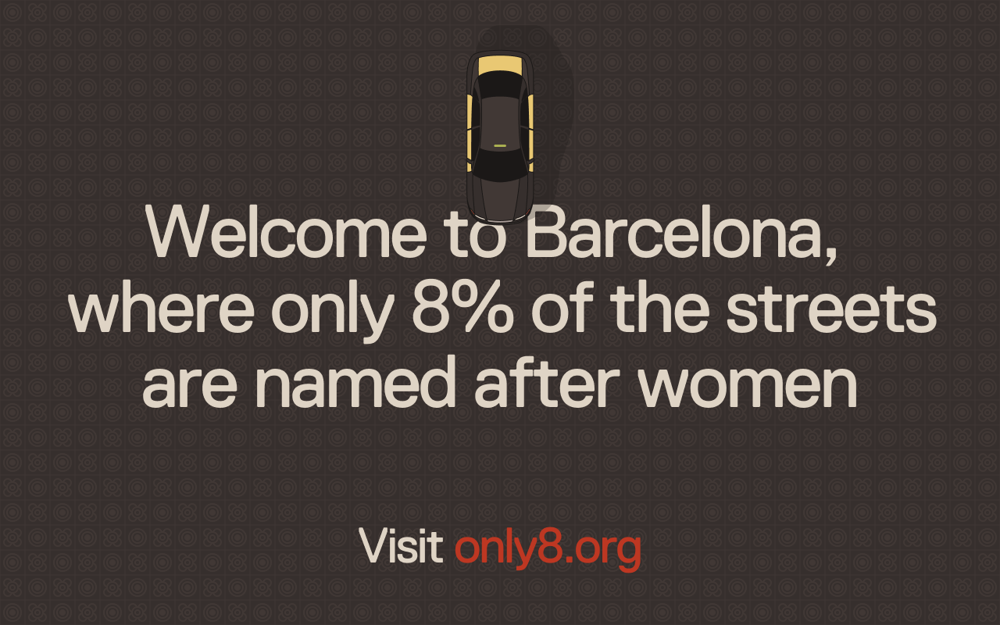

## Summary
Did you know that in Barcelona, only 8% of streets and public spaces are named after women? Sadly, this is not uncommon as worldwide, only about 10% of streets and public spaces are named after women.

## Key Details
- **Source:** [only8.org](https://only8.org/)
- **Title:** Welcome to Barcelona, where only 8% of the streets are named after women
- **Description:** Did you know that in Barcelona, only 8% of streets and public spaces are named after women? Sadly, this is not uncommon as worldwide, only about 10% o

## Visual Assets

