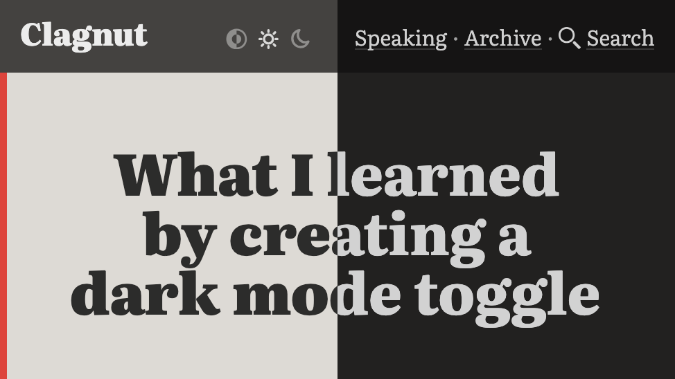

## Summary
The short answer is: quite a lot. The long answer covers some accessibility issues, some new CSS, some slightly older CSS, some high level colour theory, a bit about SVGs, and some typography finessin

## Key Details
- **Source:** [clagnut.com](https://clagnut.com/blog/2437)
- **Title:** What I learned by creating a dark mode toggle
- **Description:** The short answer is: quite a lot. The long answer covers some accessibility issues, some new CSS, some slightly older CSS, some high level colour theo

## Visual Assets

