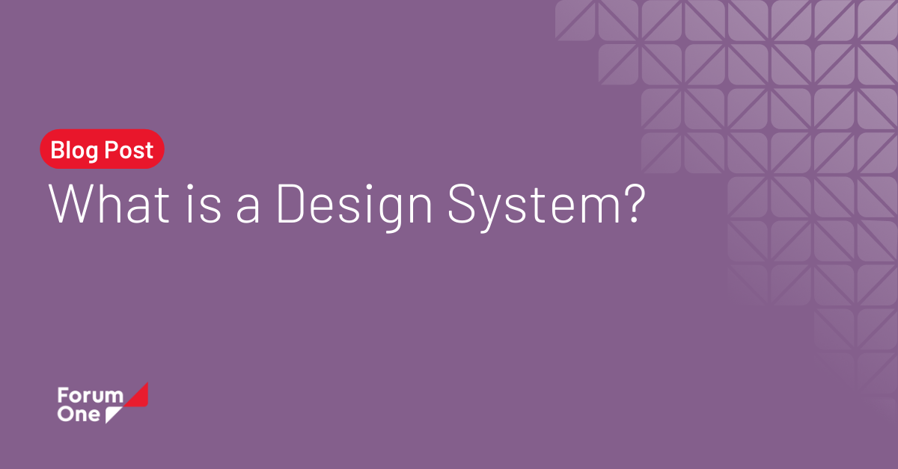

## Summary
A design system is a series of components that can be reused in different combinations. Design systems allow you to manage design at scale.

## Key Details
- **Source:** [forumone.com](https://www.forumone.com/insights/blog/what-is-design-system/)
- **Title:** What is a Design System?
- **Description:** A design system is a series of components that can be reused in different combinations. Design systems allow you to manage design at scale.

## Visual Assets

