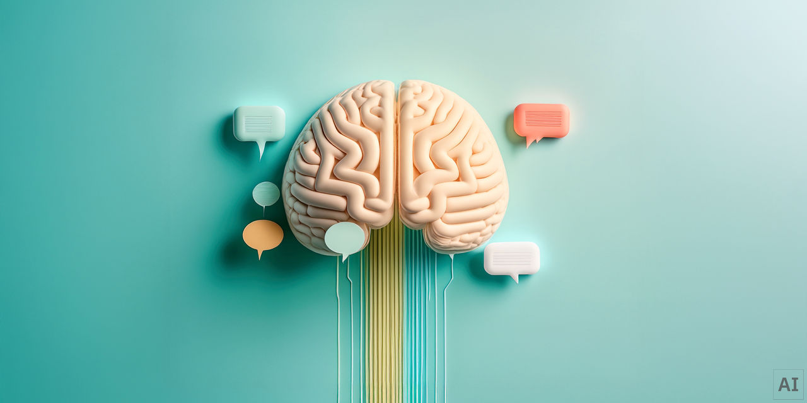

## Summary
Artificial intelligence (AI) is technology that enables computers and machines to simulate human learning, comprehension, problem solving, decision-making, creativity and autonomy.

## Key Details
- **Source:** [ibm.com](https://www.ibm.com/think/topics/artificial-intelligence)
- **Title:** What Is Artificial Intelligence (AI)? | IBM
- **Description:** Artificial intelligence (AI) is technology that enables computers and machines to simulate human learning, comprehension, problem solving, decision-ma

## Visual Assets

