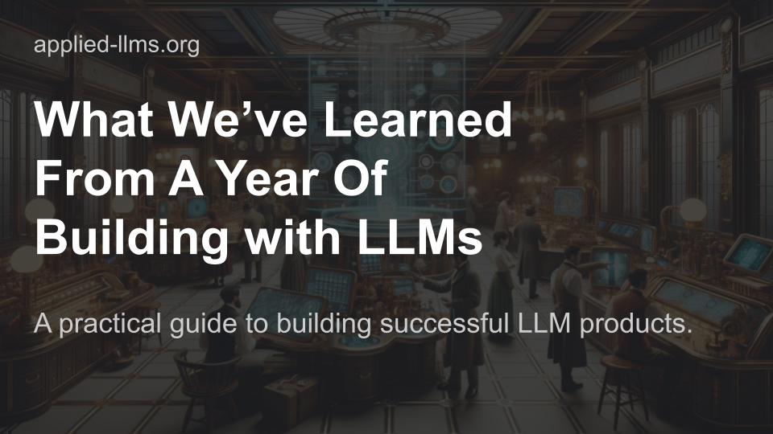

## Summary
A practical guide to building successful LLM products, covering the tactical, operational, and strategic.

## Key Details
- **Source:** [applied-llms.org](https://applied-llms.org/)
- **Title:** What We’ve Learned From A Year of Building with LLMs – Applied LLMs
- **Description:** A practical guide to building successful LLM products, covering the tactical, operational, and strategic.

## Visual Assets

