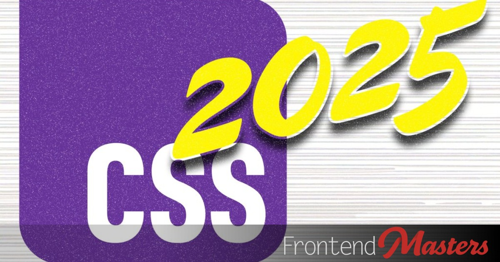

## Summary
If you thought 2024 was packed with amazing new CSS, well, you

## Key Details
- **Source:** [frontendmasters.com](https://frontendmasters.com/blog/what-you-need-to-know-about-modern-css-2025-edition/)
- **Title:** What You Need to Know about Modern CSS (2025 Edition) – Frontend Masters Blog
- **Description:** If you thought 2024 was packed with amazing new CSS, well, you

## Visual Assets

