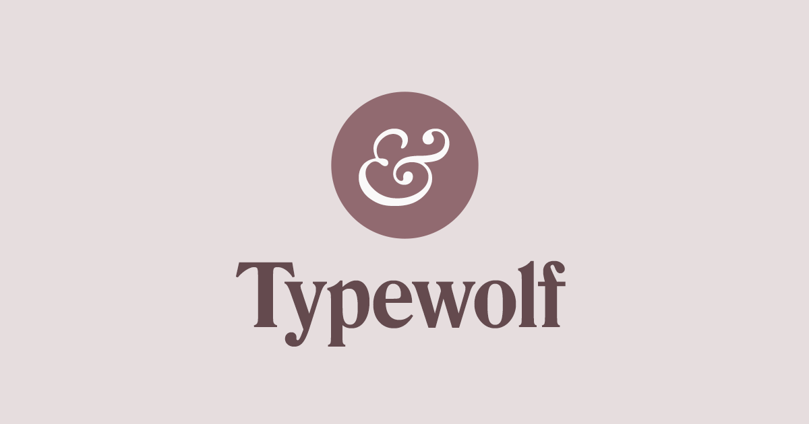

## Summary
Typewolf helps designers choose the perfect font combination for their next design project—features web fonts in the wild, font recommendations and learning resources.

## Key Details
- **Source:** [typewolf.com](https://www.typewolf.com)
- **Title:** What’s Trending in Type
 · Typewolf
- **Description:** Typewolf helps designers choose the perfect font combination for their next design project—features web fonts in the wild, font recommendations and le

## Visual Assets

