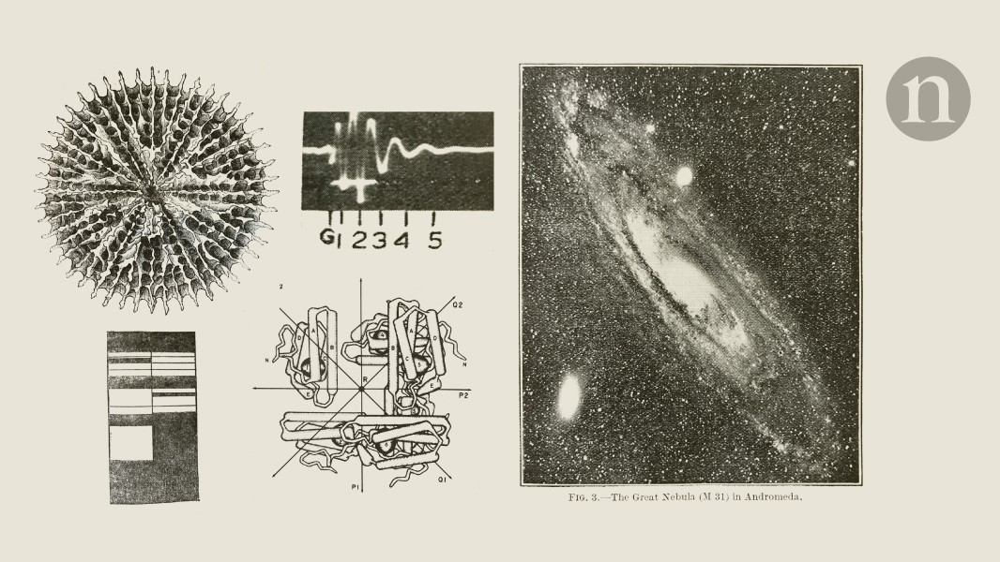

## Summary
Snippets from Nature’s past.

## Key Details
- **Source:** [nature.com](https://www.nature.com/articles/d41586-024-03848-7)
- **Title:** Where does poetry come from?
- **Description:** Snippets from Nature’s past.

## Visual Assets

