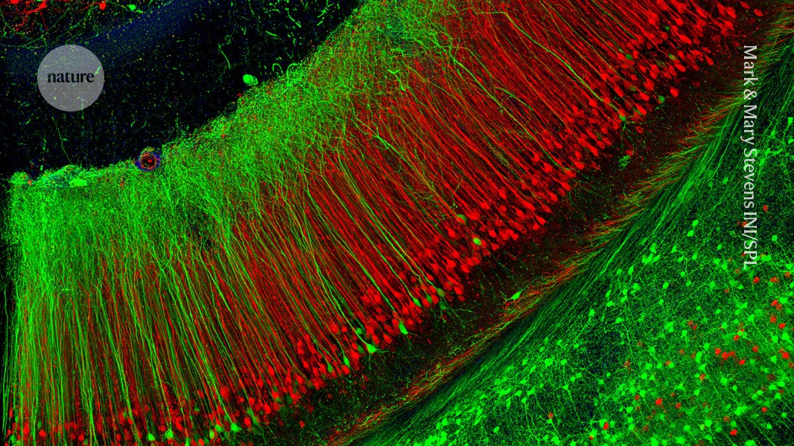

## Summary
Research in mice points towards a mechanism that avoids ‘catastrophic forgetting’.

## Key Details
- **Source:** [nature.com](https://www.nature.com/articles/d41586-024-04232-1)
- **Title:** Why don’t new memories overwrite old ones? Sleep science holds clues
- **Description:** Research in mice points towards a mechanism that avoids ‘catastrophic forgetting’.

## Visual Assets

