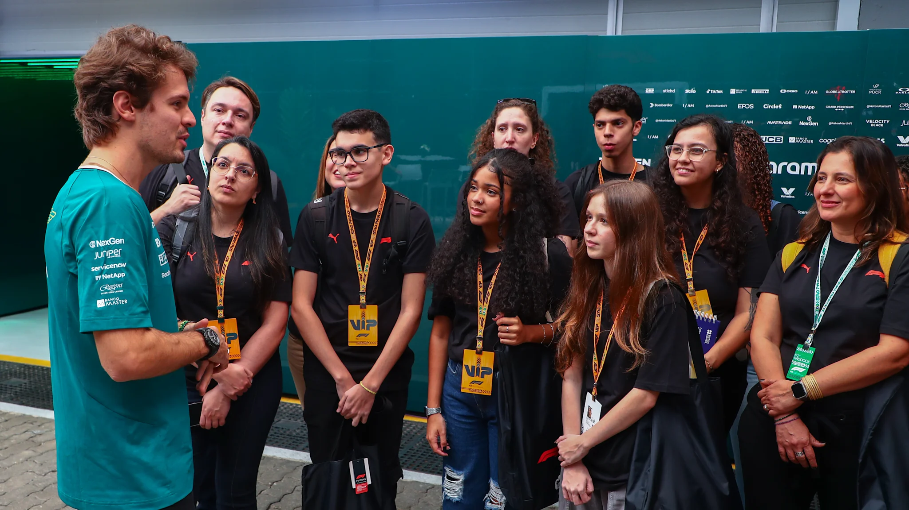

## Summary
This week saw Formula 1 – in collaboration with the British Council – launch ‘Learning Sectors’, a new education programme aimed at inspiring young people around the world to get involved in science, 

## Key Details
- **Source:** [formula1.com](https://www.formula1.com/en/latest/article.explained-why-f1s-new-learning-sectors-programme-marks-an-important-first.6GwMvDUXaSBsnLnLbPUL4g.html)
- **Title:** Why F1’s ‘Learning Sectors’ programme is an important first
- **Description:** This week saw Formula 1 – in collaboration with the British Council – launch ‘Learning Sectors’, a new education programme aimed at inspiring young pe

## Visual Assets

