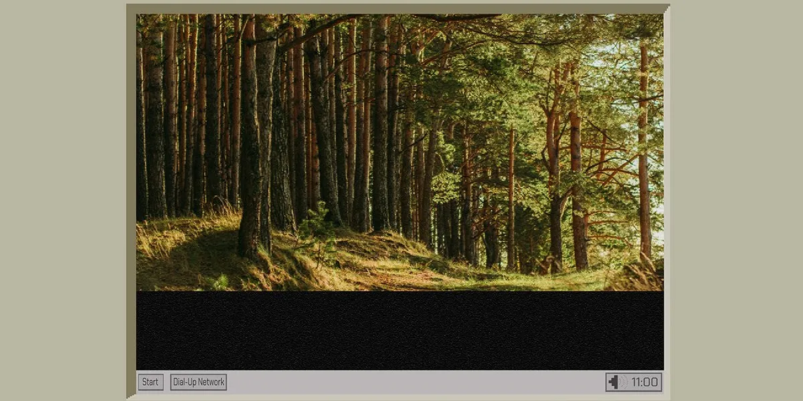

## Summary
What makes JPEG files so special? Discover the technical magic that keeps them at the forefront of digital photography.

## Key Details
- **Source:** [spectrum.ieee.org](https://spectrum.ieee.org/jpeg-image-format-history)
- **Title:** Why JPEG Became the Web's Favorite Image Format
- **Description:** What makes JPEG files so special? Discover the technical magic that keeps them at the forefront of digital photography.

## Visual Assets

