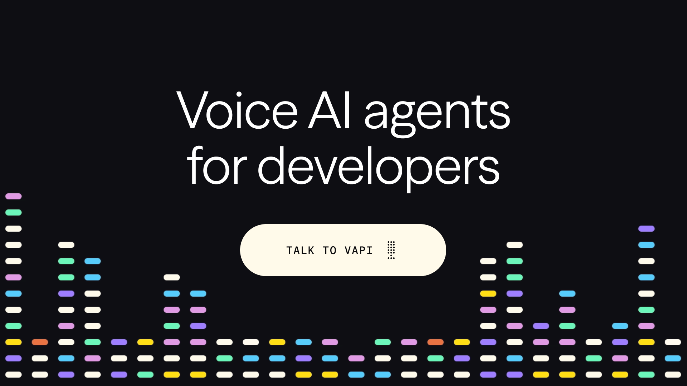

## Summary
Build, test, and deploy advanced voice AI agents in minutes with Vapi. The platform for developers creating conversational voice AI.

## Key Details
- **Source:** [vapi.ai](https://vapi.ai/)
- **Title:** width=device-width, initial-scale=1.0
- **Description:** Build, test, and deploy advanced voice AI agents in minutes with Vapi. The platform for developers creating conversational voice AI.

## Visual Assets

