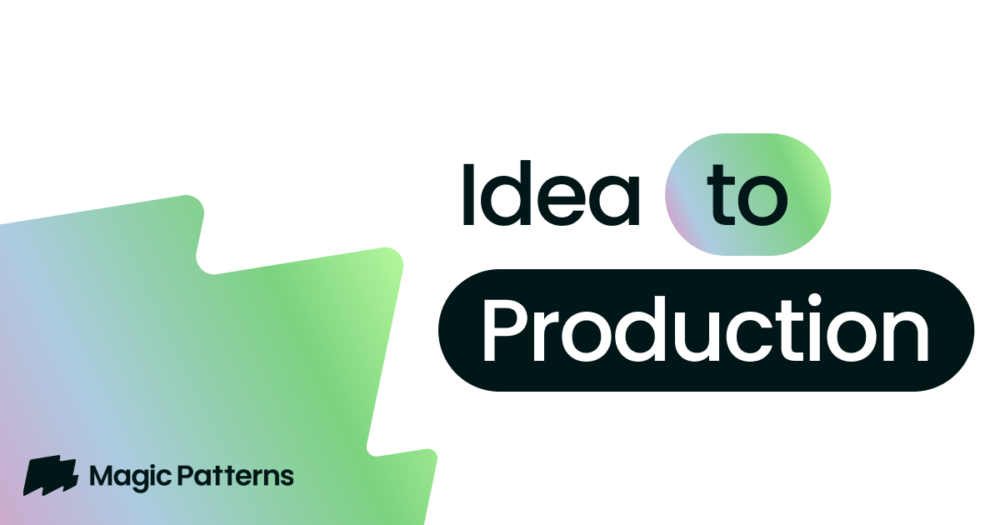

## Summary
AI prototyping tool to turn prompts into production-ready UI. Use your design system, generate prototypes fast, and collaborate.

## Key Details
- **Source:** [magicpatterns.com](https://www.magicpatterns.com)
- **Title:** width=device-width, initial-scale=1.0, maximum-scale=1.0, user-scalable=no
- **Description:** AI prototyping tool to turn prompts into production-ready UI. Use your design system, generate prototypes fast, and collaborate.

## Visual Assets

