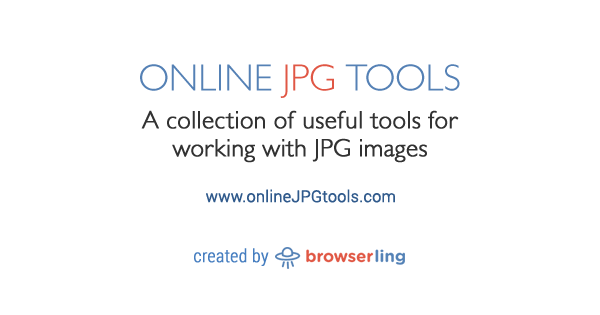

## Summary
Incredibly simple, free, and fast browser-based utility for extracting the dominant color palette from JPEG pictures. Just paste your original JPEG picture here and you

## Key Details
- **Source:** [onlinejpgtools.com](https://onlinejpgtools.com/find-dominant-jpg-colors)
- **Title:** width=device-width,minimum-scale=1,initial-scale=1
- **Description:** Incredibly simple, free, and fast browser-based utility for extracting the dominant color palette from JPEG pictures. Just paste your original JPEG pi

## Visual Assets

