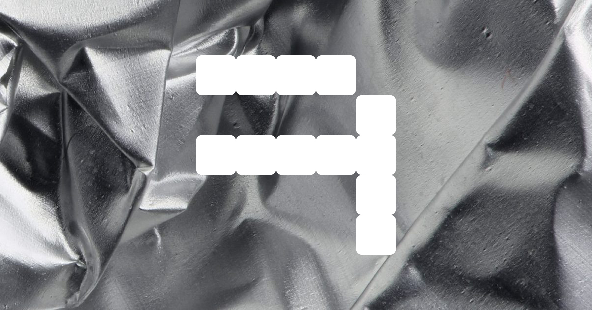

## Summary
Autograph is an independent design studio led by Peter Korsman (1982) and is based in ’s-Hertogenbosch, the Netherlands.

## Key Details
- **Source:** [autograph.works](https://autograph.works/)
- **Title:** Work - Autograph | Peter Korsman
- **Description:** Autograph is an independent design studio led by Peter Korsman (1982) and is based in ’s-Hertogenbosch, the Netherlands.

## Visual Assets

