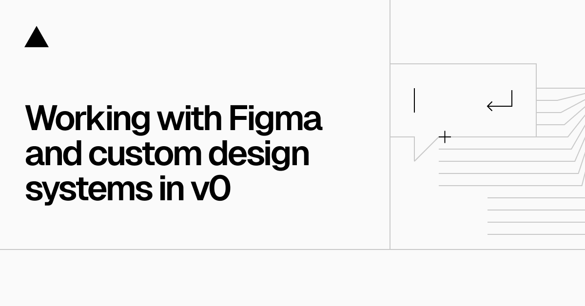

## Summary
Learn best practices on importing your designs from Figma, working with shadcn/ui, and leveraging public npm packages. 

## Key Details
- **Source:** [vercel.com](https://vercel.com/blog/working-with-figma-and-custom-design-systems-in-v0)
- **Title:** Working with Figma and custom design systems in v0 - Vercel
- **Description:** Learn best practices on importing your designs from Figma, working with shadcn/ui, and leveraging public npm packages. 

## Visual Assets

