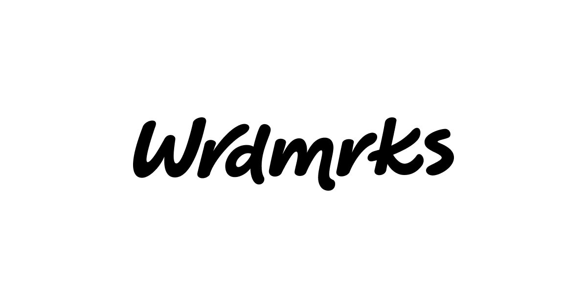

## Summary
Wrdmrks is a comprehensive library showcasing an extensive collection of predominantly custom made wordmarks.

## Key Details
- **Source:** [wrdmrks.com](https://wrdmrks.com/)
- **Title:** wrmdrks | Wordmark library
- **Description:** Wrdmrks is a comprehensive library showcasing an extensive collection of predominantly custom made wordmarks.

## Visual Assets

