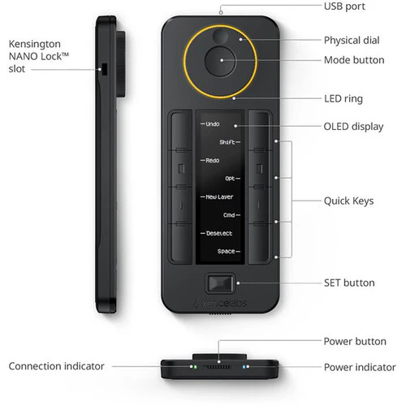

## Summary
Xencelabs K02-A Overview Xencelabs Quick KeysIntroducing the Xencelabs Pen Tablet Medium and Quick Keys� Give your creative workflow a major boost with the Quick Keys Remote from Xencelabs. This compa

## Key Details
- **Source:** [tanotis.com](https://www.tanotis.com/products/xencelabs-quick-keys-remote)
- **Title:** Xencelabs Quick Keys Remote
- **Description:** Xencelabs K02-A Overview Xencelabs Quick KeysIntroducing the Xencelabs Pen Tablet Medium and Quick Keys� Give your creative workflow a major boost wit

## Visual Assets

