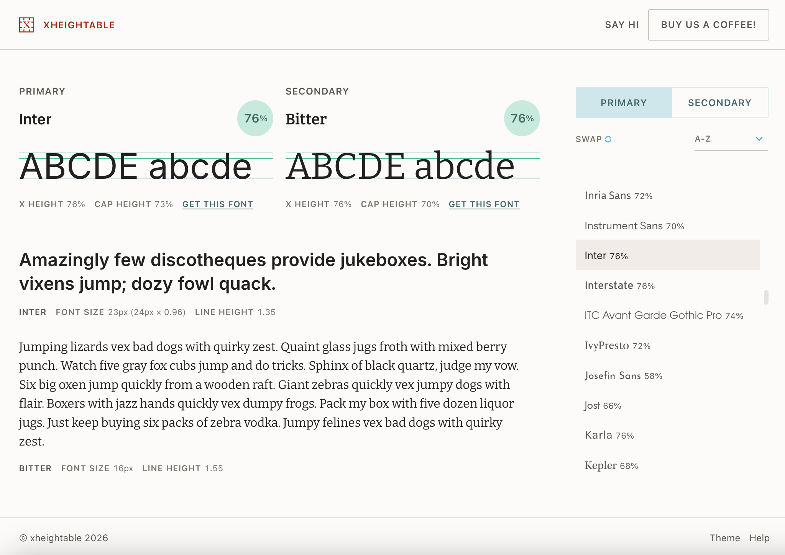

## Summary
xheightable is a free tool for pairing fonts using their xheights. Choose from over 100 fonts from Google, Adobe and Fontshare and find your perfect match.

## Key Details
- **Source:** [xheightable.com](https://xheightable.com/)
- **Title:** xheightable
- **Description:** xheightable is a free tool for pairing fonts using their xheights. Choose from over 100 fonts from Google, Adobe and Fontshare and find your perfect m

## Visual Assets

