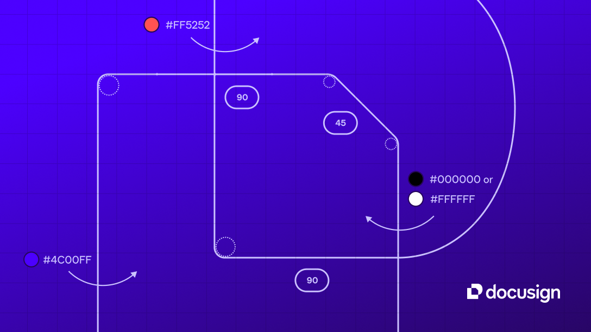

## Summary
Your central hub for Docusign’s brand system. Explore our latest work, access guidelines, and find the tools that help internal teams and external vendors keep every touchpoint on-brand.

## Key Details
- **Source:** [brand.docusign.com](https://brand.docusign.com/)
- **Title:** Your central hub for Docusign’s brand system. Explore our latest work, access guidelines, and find the tools that help internal teams and external vendors keep every touchpoint on-brand.
- **Description:** Your central hub for Docusign’s brand system. Explore our latest work, access guidelines, and find the tools that help internal teams and external ven

## Visual Assets

