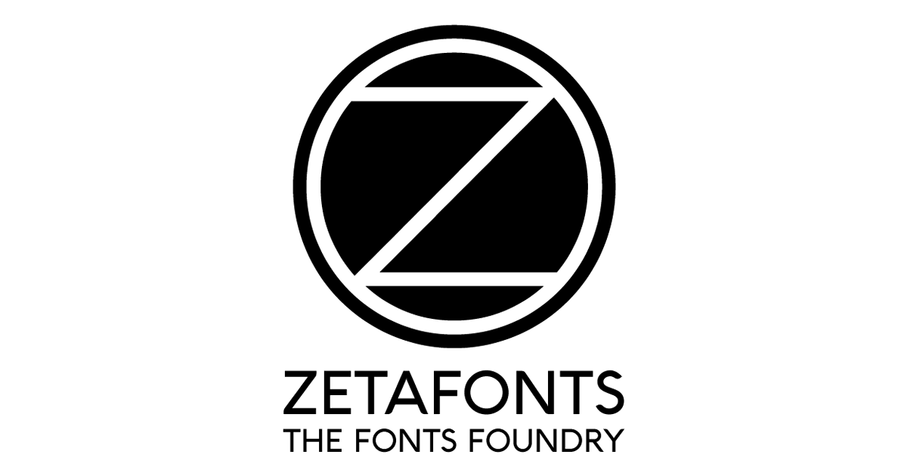

## Summary
Zetafonts is a independent type foundry established in 2001  by Francesco Canovaro, Debora Manetti and Cosimo Lorenzo Pancini. Powered by a team of branding and design veterans, Zetafonts offers a pro

## Key Details
- **Source:** [zetafonts.com](https://www.zetafonts.com/)
- **Title:** zetafonts · the Italian type foundry
- **Description:** Zetafonts is a independent type foundry established in 2001  by Francesco Canovaro, Debora Manetti and Cosimo Lorenzo Pancini. Powered by a team of br

## Visual Assets

